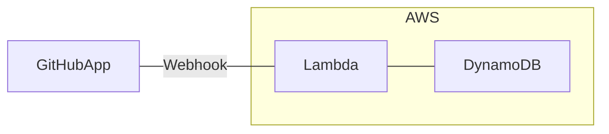

# slack-notification-github

## 機能

### レビュー

- [x] PR作成時に指定したSlackチャンネルにレビュー依頼を投稿する
- [ ] レビュアーにメンションをつける
- [ ] PR作成者にメンションをつける
- [ ] レビューコメント追加時に指定したSlackチャンネルに通知する
- [ ] Approve時に指定したSlackチャンネルに通知する
- [ ] Approve時にSlackのレビュー依頼投稿にリアクションをつける
- [ ] マージ時にSlackのレビュー依頼投稿にリアクションをつける
- [ ] レビュアーにアサインされたタイミングでSlack DMで通知する

### デバッグ

- [x] (デバッグ)GitHub AppのWebhookイベント受信時に指定したSlackチャンネルにJSONを投稿する

## デプロイ

### 初回のデプロイ時のみ

```bash
npm run cdk bootstrap
```

### デプロイ時毎回

```bash
npm run deploy
```

## 構成


